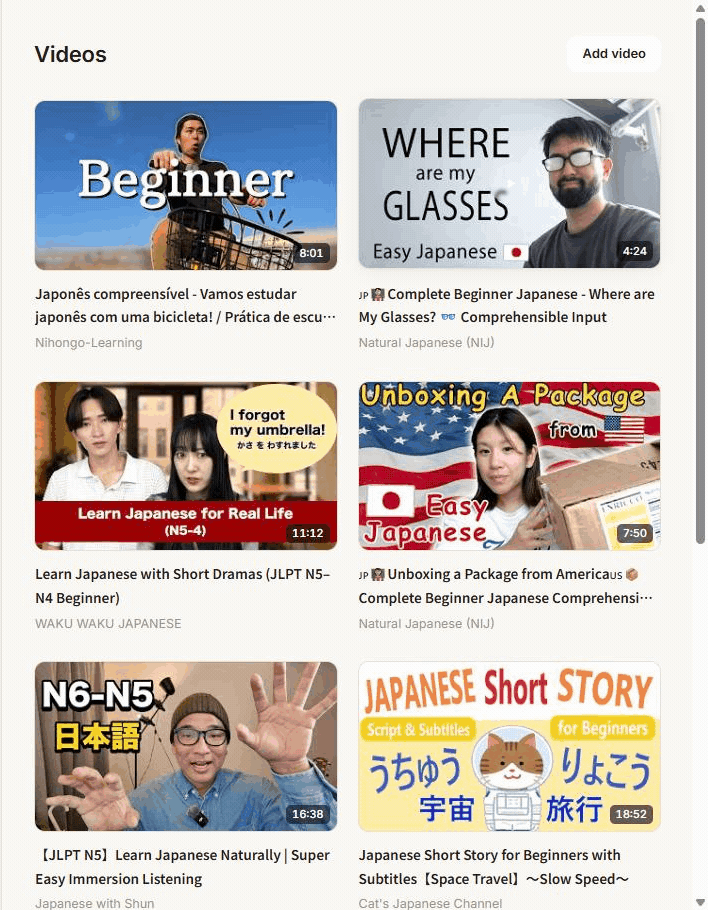

# Fuchine

**Learn Japanese by immersion in video.** Import a YouTube video, study it with
intelligent dual subtitles (tokenization, pop-up dictionary, per-line AI
explanations), mine sentences in one click, and review them with an FSRS-based
SRS that replays the exact clip from the original video.

The name comes from 淵 (*fuchi*), "the depths" — diving into the language.

> **Status:** F1 (usable MVP). The full study loop works end to end — import →
> watch with smart subtitles → mine → review. Launch polish is in progress.

## Demo

<!-- TODO(readme): record a GIF of the loop (import → watch → mine → review) and
     drop it at docs/assets/demo.gif. Until then this link 404s on purpose. -->


> paste a URL → watch with smart subtitles → mine sentences → review in the SRS → back to the video

## Why Fuchine

- **Open core, self-hostable.** The open repository is the whole product. BYOK
  (bring your own LLM key) and you pay only your own AI bill.
- **Structurally cheap AI**, via layered processing (local → cheap → expensive
  on demand) and a shared, versioned cache.
- **One app for the whole loop** — watch, mine, and review without exporting to
  another tool; reviews replay the original video clip.
- **Modern SRS (FSRS)** instead of classic SM-2.
- **Multilingual by design** — Japanese is the first language, not the only one.

## How it compares

A best-effort comparison of *structural* properties (not a feature-by-feature
benchmark — competitor features evolve, so corrections are welcome). "~" means
partial or via an add-on/integration.

| | Fuchine | Language Reactor | Migaku | asbplayer | Anki (manual) |
|---|:---:|:---:|:---:|:---:|:---:|
| Open source | ✓ (AGPL-3.0) | ✗ | ✗ | ✓ | ✓ |
| Self-hostable | ✓ | ✗ | ✗ | ~ | ✓ |
| No subscription / BYOK | ✓ | ✗ (Pro) | ✗ (sub) | ✓ | ✓ |
| Dual subtitles + tokenization | ✓ | ✓ | ✓ | ~ | ✗ |
| Pop-up dictionary | ✓ | ✓ | ✓ | ~ (Yomitan) | ✗ |
| Per-line AI explanation | ✓ | ~ (word-level) | ~ (word-level) | ✗ | ✗ |
| Mine → SRS in the same app | ✓ | ✓ (Pro) | ✓ | ~ (Anki) | ✗ |
| Reviews replay the source clip | ✓ (live, unstored) | ~ (saved audio) | ~ (saved audio) | ~ (Anki) | ✗ |
| FSRS scheduling | ✓ | ✗ | ✗ (own SRS) | ~ (Anki) | ✓ |
| Multilingual by design | ✓ | ✓ | ✓ | ✓ | ✓ |

## The loop

> paste a URL → watch with smart subtitles → mine sentences → review in the SRS → back to the video

## Quick start (self-host)

```bash
cp .env.example .env          # fill in secrets + your AI provider (BYOK)
docker compose up -d          # Postgres + Redis
pnpm install
pnpm db:migrate               # apply the schema
pnpm --filter @fuchine/db seed:jmdict   # load the JMdict dictionary (~298k entries)
pnpm dev                      # web + worker
```

Requires Node 22+ and pnpm 10+.

**AI is BYOK.** Layer-1 translation runs from the `LLM_*` env vars (see
`.env.example` for MiniMax / OpenAI-compatible / DeepL options); per-user layer-2
explanations use the key each user sets in **Settings**. Without a key the app
still works — videos stay studiable with tokenization and the local dictionary,
AI just degrades gracefully.

## Monorepo layout

| Path | What |
|---|---|
| `apps/web` | Next.js — UI + API routes |
| `apps/worker` | BullMQ consumers — the import pipeline |
| `packages/core` | Domain: entities, services, FSRS |
| `packages/db` | Drizzle schema + migrations + seeds |
| `packages/nlp` | `Tokenizer` / `DictionaryProvider` interfaces + `ja` adapter |
| `packages/llm` | LLM providers + key resolution + AI cache |
| `docs/` | Architecture, AI contract, screen inventory — the source of truth |

## Documentation

- [`docs/ARQUITETURA.md`](docs/ARQUITETURA.md) — vision, open-core model, locked
  decisions (D1–D8), system architecture, roadmap.
- [`docs/CONTRATO_IA.md`](docs/CONTRATO_IA.md) — input/output contract for the AI
  functions and the cache.
- [`docs/INVENTARIO_TELAS.md`](docs/INVENTARIO_TELAS.md) /
  [`docs/PROMPT_PACK_TELAS.md`](docs/PROMPT_PACK_TELAS.md) — product screens.

## License

[AGPL-3.0-only](LICENSE). Third-party attributions (JMdict/EDRDG, etc.) are in
[`NOTICE`](NOTICE). Contributions under the
[DCO](https://developercertificate.org/).
