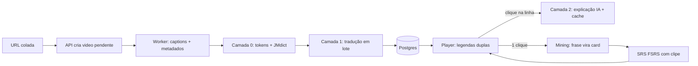

# Arquitetura — plataforma de imersão em japonês por vídeo

**Versão 0.1 · 12 de junho de 2026 · nome do projeto: a definir**

Este documento consolida as decisões de produto, negócio e arquitetura definidas na fase de estruturação. É uma referência viva: mudanças entram por revisão deste arquivo, não por decisões soltas em conversas.

---

## 1. Visão do produto

Plataforma open core de aprendizado de japonês por imersão em vídeo. O usuário importa vídeos do YouTube, estuda com legendas duplas inteligentes (tokenização, dicionário pop-up, explicações de IA por linha), minera frases em um clique e revisa com SRS baseado em clipes — o card de revisão toca o trecho exato do vídeo original.

O produto cobre o mesmo território do HayaiLearn, com quatro diferenciais deliberados:

1. **Código aberto** com self-host completo (BYOK), gerando confiança e distribuição orgânica que um SaaS fechado desconhecido não teria.
2. **Custo de IA estruturalmente menor**, via processamento em camadas (local → barato → caro sob demanda) e cache compartilhado entre usuários.
3. **SRS moderno (FSRS)** em vez do SM-2 clássico.
4. **Arquitetura multilíngue por design** — japonês é o primeiro idioma, não o único possível.

**Público-alvo:** autodidatas de imersão (comunidades estilo Refold/AJATT, r/LearnJapanese) e estudantes que já dominam kana e querem listening, gramática em contexto e vocabulário de uso real — pessoas que hoje extraem transcrições manualmente para colar em ChatGPT/Anki.

**Loop central do produto:**

> colar URL → assistir com legendas inteligentes → minerar frases → revisar no SRS → voltar ao vídeo

Tudo o mais existe para servir esse loop.

---

## 2. Modelo de negócio: open core

**Regra de ouro:** o núcleo aberto é o produto completo. A camada paga vende serviço e conveniência — nunca funcionalidade removida do código. Núcleo mutilado mata a comunidade e, com ela, o marketing do plano pago.

### 2.1. Divisão entre aberto e pago

| Camada | O que contém | Por que se sustenta |
|---|---|---|
| **Núcleo aberto (AGPL-3.0)** | Player com legendas duplas, dicionário pop-up (JMdict), tokenização local, mining em 1 clique, SRS com clipes (FSRS), álbuns, stats, extensão Chrome, BYOK nas configurações | É o produto inteiro. Quem self-hosteia tem tudo, pagando a própria conta de LLM. |
| **Cloud paga** | IA gerenciada (sem chave, sem setup), cache compartilhado de vídeos processados, Whisper para vídeos sem legenda, backups e sync gerenciados | Cada item é serviço com custo real ou efeito de rede — nada é feature trancada. |

O **cache compartilhado é o fosso estrutural da cloud:** cada vídeo processado fica instantâneo e gratuito para o próximo usuário, enquanto toda instância self-hosted começa com cache vazio. A cloud melhora sozinha conforme cresce, sem precisar bloquear nada no código aberto.

### 2.2. Licença e contribuições

- **AGPL-3.0** no repositório inteiro: impede que terceiros hospedem o código comercialmente sem abrir as modificações.
- **DCO** (Developer Certificate of Origin) nas contribuições, em vez de CLA burocrático: mantém flexibilidade jurídica sem espantar contribuidores.
- Chaves de API de usuários (BYOK) nunca entram em logs nem em texto puro no banco (ver §6.3).

### 2.3. Sequenciamento e preço

1. Lançar como **open source puro com BYOK** ao fim da Fase 1. Zero energia em billing.
2. Construir a cloud paga **apenas quando os sinais aparecerem**: issues pedindo versão hospedada, self-hosters reclamando de manutenção, crescimento de stars/tráfego. Cada sinal é validação gratuita de demanda.
3. Âncora de preço quando chegar a hora: HayaiLearn cobra ~US$ 10/mês. Posicionar próximo ou abaixo, com a vantagem de confiança do código aberto e **preço regional em real** — algo que nenhum concorrente estrangeiro faz bem.

> **Atualização 2026-07-06:** foco comercial definido em **clientes pagantes
> em dólar** — preço único em US$ no lançamento da cloud; o preço regional em
> real passa a alavanca de expansão posterior. Números, cenários e racional em
> `docs/ANALISE_CUSTOS.md` (§6.1: Pro US$ 8/mês · US$ 79/ano, a lápis até
> haver medição de uso real).

---

## 3. Decisões arquiteturais travadas

Decisões caras de reverter, registradas com racional. Mudá-las exige atualizar este documento.

| # | Decisão | Racional e consequências |
|---|---|---|
| D1 | **Nunca armazenar vídeo ou áudio.** Clipes tocam via player oficial do YouTube (IFrame API) com `start`/`end`; o banco guarda apenas texto de legenda e timestamps. | Storage ~zero, sem violação de ToS/copyright. Netflix fica fora do escopo (não reproduz fora do site oficial). |
| D2 | **Processamento em camadas por custo.** Camada 0 (local, grátis): tokenização + dicionário + leituras + frequência. Camada 1 (barata, no import): tradução linha a linha em lote com modelo econômico. Camada 2 (cara, sob demanda): explicação profunda da linha, gerada só no clique e cacheada para sempre. | Importar um vídeo custa centavos; o caro só roda quando agrega valor; o custo marginal cai com o tempo. |
| D3 | **Cache de IA compartilhado e versionado.** Chave: `(subtitle_line_id, tipo, idioma_alvo, prompt_version)`. Na cloud, o cache é global entre usuários; no self-host, é local à instância. | Segundo usuário do mesmo vídeo custa zero. `prompt_version` permite invalidação controlada quando os prompts melhorarem. |
| D4 | **Multilíngue por design, japonês primeiro.** Campo `language` em todas as entidades de conteúdo desde a primeira migration. Interfaces `Tokenizer` e `DictionaryProvider` por idioma; japonês é o primeiro adapter. | Adicionar coreano/mandarim = escrever dois adapters, não migrar o banco. |
| D5 | **Camada de LLM plugável com BYOK nativo.** Interface provider-agnostic (Anthropic, OpenAI, Gemini, local). Self-host resolve a chave do usuário; cloud resolve a chave da casa com quota por plano. | Mantém self-host e cloud rodando o mesmo código. Trocar de provider é configuração, não refactor. |
| D6 | **FSRS como algoritmo de SRS** (não SM-2). Estado por card + log completo de reviews. | Agendamento mais eficiente que Anki clássico; logs permitem re-otimizar parâmetros por usuário no futuro. |
| D7 | **Entrada por URL colada no MVP.** A extensão Chrome (Fase 2) é apenas outra porta de entrada para a mesma API de import. | Corta semanas do MVP sem fechar portas; nenhum retrabalho quando a extensão chegar. |
| D8 | **Vídeo precisa ter legenda em japonês** (manual ou automática) para ser importado. Transcrição via Whisper é recurso futuro da cloud. | Mesma limitação do HayaiLearn no MVP; Whisper vira diferencial pago quando chegar (custo real por minuto). |

---

## 4. Arquitetura do sistema

### 4.1. Componentes

| Componente | Responsabilidade |
|---|---|
| **Web (Next.js)** | UI + API routes. Player, telas de estudo, revisão, álbuns, configurações. |
| **Worker (BullMQ)** | Pipeline assíncrono de importação (camadas 0 e 1). Idempotente, com retry e backoff. |
| **Postgres** | Fonte da verdade: conteúdo, cards, reviews, cache de IA, stats. |
| **Redis** | Fila do worker + cache quente de sessão. |
| **`packages/nlp`** | Interfaces de tokenização/dicionário + adapter japonês. |
| **`packages/llm`** | Providers de LLM + resolução de chave + cache. |

### 4.2. Fluxo de ponta a ponta



**Pipeline de importação (roda uma vez por vídeo):**

1. Usuário cola a URL → API valida, verifica existência de legenda JP e cria `videos` com `status = pendente`. Se o vídeo já existe no banco (cloud), retorna o processado na hora — é o cache compartilhado em ação.
2. Worker busca metadados e o track de legendas em japonês pela via oficial.
3. Camada 0: tokeniza cada linha, resolve lemas no JMdict, calcula leituras e frequência. Local e gratuito.
4. Camada 1: traduz as linhas em lote com modelo econômico. Marca `status = concluído` (ou `falhou` com motivo legível).

Cada passo é idempotente: re-rodar um job não duplica dados.

**Loop de estudo:**

- O player (YouTube IFrame API) sincroniza o overlay de legendas duplas pelos timestamps.
- Clique em palavra → popup do dicionário com dados locais (instantâneo, custo zero).
- Botão "explicar" na linha → camada 2, cache-first: consulta `ai_explanations` antes de chamar o LLM.
- Botão "minerar" → cria `sentence_cards` com referência à linha e ao trecho do vídeo.
- Sessão de revisão → FSRS calcula o próximo agendamento a partir da nota (errei / difícil / ok / fácil) e grava o log.

---

## 5. Modelo de dados (resumo)

O ERD completo é o próximo artefato; este resumo registra as entidades e os campos que travam decisões.

| Entidade | Campos-chave | Notas |
|---|---|---|
| `users` | id, email, plan, created_at | `plan` só importa no modo cloud. |
| `user_settings` | user_id, llm_provider, llm_api_key_encrypted, target_lang, daily_goals | Chave BYOK cifrada (AES-GCM), nunca em texto puro. |
| `videos` | id, source, source_id, url, title, channel, duration_s, **language**, status, level_estimate | `source = youtube` no MVP. Único por `(source, source_id)` — base do cache compartilhado. |
| `subtitle_lines` | id, video_id, idx, t_start_ms, t_end_ms, text_original, text_translation, tokens (jsonb) | Tokens embutidos em jsonb evitam explosão de linhas; cada token referencia `word_entry_id`. |
| `word_entries` | id, **language**, lemma, reading, pos, definitions (jsonb), frequency_rank | Populada do jmdict-simplified no seed. |
| `word_examples` | word_entry_id, subtitle_line_id, video_id | Preenchida no import; alimenta "ver exemplos em vídeo" e filtros por álbum. |
| `sentence_cards` | id, user_id, subtitle_line_id, video_id, t_start_ms, t_end_ms, notes, + estado FSRS (stability, difficulty, due_at, state, reps, lapses) | O card carrega o próprio estado de agendamento. |
| `review_logs` | id, card_id, grade, reviewed_at, elapsed_ms, scheduled_days | Histórico completo: permite re-otimizar FSRS depois. |
| `ai_explanations` | id, subtitle_line_id, kind, target_lang, prompt_version, model, content (jsonb) | **Cache da camada 2.** Único por `(subtitle_line_id, kind, target_lang, prompt_version)`. |
| `albums` / `album_videos` | id, user_id, name / album_id, video_id | Coleções do usuário; filtram biblioteca, exemplos e sessões de revisão. |
| `user_word_stats` | user_id, word_entry_id, views, clicks, reviews_ok, reviews_total | Base das stats por palavra (vistas, difíceis, dominadas). |
| `user_daily_stats` | user_id, date, ms_watched, lines_seen, cards_created, reviews_done | Base de streak e gráficos de tempo. |

---

## 6. Camada de IA (`packages/llm`)

### 6.1. Interface provider-agnostic

```ts
interface LlmProvider {
  translateBatch(lines: string[], opts: { from: string; to: string }): Promise<string[]>;
  explainLine(line: SubtitleLineCtx, opts: { targetLang: string }): Promise<Explanation>;
}

type Explanation = {
  summary: string;            // o que a frase significa, em linguagem natural
  grammarPoints: GrammarPoint[]; // padrões detectados, com nível estimado
  nuance?: string;            // registro, gíria, contexto cultural
};
```

Implementações: `anthropic`, `openai`, `gemini`, `ollama` (local). A escolha é configuração, não código.

### 6.2. Resolução de chave

- **Self-host:** chave do usuário (BYOK) vinda de `user_settings`. Sem chave → a UI explica como obter uma e tudo da camada 0 continua funcionando.
- **Cloud:** chave da casa, com quota por plano e medição de custo por usuário (módulo cloud, ver §9).

### 6.3. Segurança das chaves

Chaves BYOK são cifradas com AES-GCM usando segredo do servidor antes de tocar o banco, nunca aparecem em logs e são mascaradas na UI. Na cloud, o usuário pode optar por chave apenas em sessão (não persistida).

### 6.4. Uso por camada e ordem de grandeza de custo

| Camada | Chamada | Modelo | Quando roda | Custo típico |
|---|---|---|---|---|
| 1 | `translateBatch` | econômico (classe Haiku/mini) | uma vez, no import | centavos de dólar por vídeo de ~20 min |
| 2 | `explainLine` | intermediário | no clique, cache-first | ~1–2k tokens por linha explicada, uma única vez por linha/idioma/versão de prompt |

Prompts são versionados em código (`prompt_version`); subir a versão invalida o cache de forma controlada, sem apagar nada.

---

## 7. NLP de japonês (`packages/nlp`, camada 0)

```ts
interface Tokenizer {
  language: string;
  tokenize(text: string): Token[]; // superfície, lema, leitura, classe gramatical
}

interface DictionaryProvider {
  language: string;
  lookup(lemma: string): WordEntry[];
}
```

- **Tokenização:** `kuromoji.js` no MVP (zero infra extra, roda no worker em TS, fornece forma base para lookup). Caminho de upgrade já desenhado: microserviço Python com SudachiPy quando a precisão exigir — troca-se o adapter, nada mais.
- **Dicionário:** `jmdict-simplified` (JSON) importado no Postgres como `word_entries`, com índices por lemma, leitura e kana.
- **Leituras/furigana:** leitura vinda do tokenizador, com conversão katakana → hiragana.
- **Frequência:** lista pública de frequência carregada em `frequency_rank` — alimenta o nível estimado dos vídeos e o futuro motor de recomendação.

Aceita-se imperfeição em gíria e nomes próprios no MVP; é a mesma fronteira que todos os concorrentes enfrentam, e o upgrade para Sudachi já tem caminho.

---

## 8. Stack

| Camada | Escolha | Por quê |
|---|---|---|
| Frontend + API | Next.js + TypeScript | Um deploy só; App Router; SSR onde ajuda. |
| Banco | Postgres + Drizzle | Relacional com jsonb para tokens; migrations leves e versionadas. |
| Fila / worker | Redis + BullMQ | Simples, mesmo runtime TS do resto. |
| Player | YouTube IFrame Player API | Embed oficial com controle de `start`/`end` — pilar da decisão D1. |
| Tokenização | kuromoji.js → SudachiPy (futuro) | Ver §7. |
| Dicionário | jmdict-simplified | Gratuito, mantido, fácil de importar. |
| SRS | ts-fsrs | Implementação de referência do FSRS em TS. |
| Auth | Auth.js | Email + OAuth sem reinventar roda. |
| Infra | docker-compose (self-host) · Railway/Fly/VPS (cloud) | `docker compose up` é o onboarding do self-host. |
| Extensão (F2) | WXT ou Plasmo | Framework moderno de extensão, mesma API de import. |

---

## 9. Estrutura do repositório

```
/apps/web          → Next.js (UI + API routes)
/apps/worker       → consumidores BullMQ (pipeline de import)
/packages/core     → domínio: entidades, serviços, FSRS
/packages/db       → schema Drizzle + migrations + seeds (JMdict, frequência)
/packages/nlp      → interfaces + adapter ja/
/packages/llm      → providers + resolução de chave + cache
/extension         → (Fase 2)
docker-compose.yml → app + postgres + redis em um comando
```

- O modo cloud vive atrás de `DEPLOYMENT_MODE=cloud`: billing (Stripe), quotas, medição de custo e gestão de chaves ficam num módulo separado que **não existe até a Fase 3** — e, quando existir, pode morar numa pasta própria ou num repo privado fino que importa o core.
- O **README é a landing page** do projeto: GIF do loop completo, `docker compose up`, tabela de comparação com alternativas.

---

## 10. Roadmap por fases

| Fase | Entregas | Critério de pronto |
|---|---|---|
| **F0 — Fundação** | Auth, schema completo do banco, import por URL com worker rodando camadas 0 e 1 | Colar uma URL resulta em vídeo `concluído` no banco, com tokens, dicionário e tradução. |
| **F1 — MVP usável (lançamento OSS)** | Player com legendas duplas, popup de dicionário, explicação sob demanda, mining em 1 clique, sessão de revisão FSRS com clipe | Dá para estudar 30 min por dia de verdade. → Publicar o repo + posts nas comunidades de imersão. |
| **F2 — Alcance** | Extensão Chrome, álbuns, stats básicas (tempo, palavras, streak), biblioteca pública de vídeos processados | A extensão importa em 1 clique; a biblioteca nasce do cache compartilhado. |
| **F3 — Diferenciais** | Shadowing com score, quizzes de listening, Whisper (cloud), segundo idioma (novos adapters), cloud paga | Liga-se a cloud **somente se** os sinais do §2.3 apareceram. |

As fases são contrato contra scope creep: nada da F2 começa antes do loop da F1 fechar.

---

## 11. Riscos e mitigações

| Risco | Mitigação |
|---|---|
| Dependência do YouTube (captions, embed) | Usar apenas vias oficiais (D1); degradar com aviso claro se um track sumir; nunca armazenar mídia. |
| Custo de IA descontrolado na cloud | Cache-first (D3), modelo econômico na camada 1, quotas por plano, custo medido por usuário desde o primeiro dia da cloud. |
| Vídeo sem legenda JP frustra o usuário | Validar **antes** de criar o job, com mensagem clara; Whisper como solução paga futura (D8). |
| Concorrência (Hayai, Migaku, Language Reactor) | Diferenciais estruturais: open source, custo em camadas, FSRS, preço regional. Não competir em volume de marketing. |
| Scope creep (desenvolvimento solo) | Roadmap por fases com critério de pronto (§10). |
| Qualidade de tokenização em gíria/nomes | Aceitar imperfeição no MVP; upgrade para Sudachi já desenhado (§7). |
| Fork comercial do código | AGPL-3.0 + a cloud competir por efeito de rede (cache) e conveniência, não por código secreto. |

---

## 12. Melhorias deliberadas sobre o HayaiLearn

Para não perder o fio do "quase idêntico, porém melhor": código aberto com self-host real; custo de IA em camadas com cache compartilhado (vídeos populares ficam gratuitos de processar); FSRS no lugar de SM-2; BYOK para quem quer controle total; preço regional em real; arquitetura multilíngue desde a primeira migration; e, no futuro, Whisper para estudar **qualquer** vídeo — não só os que já têm legenda.

---

## Próximos artefatos

1. **ERD completo** do banco (todas as entidades, índices e relações).
2. Spec dos **prompts da camada de IA** (tradução em lote, explicação de linha) com `prompt_version` inicial.
3. Spec da **extensão Chrome** (Fase 2).
4. Wireframes das telas do loop: player, mining, revisão.
