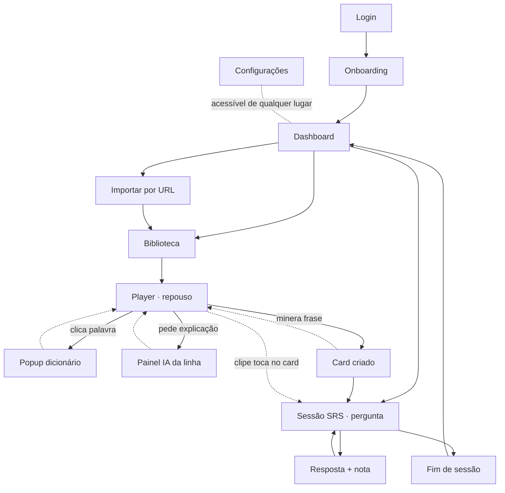

# Inventário de telas — plataforma de imersão em japonês

**Versão 0.1 · 13 de junho de 2026**

Este documento é o mapa de todas as telas que o sistema precisa ter, agrupadas por fase e marcadas como **núcleo** (toda instância, inclusive self-host) ou **cloud** (só na versão hospedada paga). Não é o design e não são os prompts — é o inventário que vamos usar depois para escrever, uma a uma, as instruções do Claude Design.

Para cada tela há propósito e elementos-chave / estados. Esse nível de detalhe é proposital: é o esqueleto que transforma "fazer a tela X" num prompt completo, sem ainda ser o prompt.

## Como está organizado — três decisões de escopo

**Dois produtos visuais no mesmo sistema.** O **app de estudo** (assistir, minerar, revisar) é o coração; as **páginas de conta** (login, configurações, billing) são a casca necessária. Estão separados abaixo para você priorizar o app.

**O player é uma tela com vários estados, não várias telas.** Legenda em repouso, palavra clicada, linha sendo explicada e frase minerada são camadas sobre a mesma tela. Cada estado está listado como item próprio porque cada um vira um prompt diferente — mas o layout-base é um só, e isso precisa ficar explícito quando você gerar.

**Fronteira núcleo vs cloud.** Configurações com campo de chave BYOK existe sempre. Billing e cota só existem no modo cloud. O MVP open source não gera as telas de cloud — elas só entram se os sinais de demanda aparecerem (ver roadmap da arquitetura).

**Convenção:** 🟢 núcleo · 🔵 só cloud

---

## Fase 1 — o loop usável (app de estudo, o que lança como OSS)

É o conjunto mínimo para estudar de verdade: importar um vídeo, assistir com legendas inteligentes, minerar frases e revisar. Quando essas telas existem e conversam, o produto fecha o ciclo.

### Entrada e navegação

| Tela | Escopo | Propósito | Elementos-chave / estados |
|---|---|---|---|
| **Login / Registro** | 🟢 | Entrar na conta | E-mail + OAuth; alternar entre login e cadastro; erro de credencial |
| **Onboarding** | 🟢 | Primeira configuração | Escolher idioma de explicação; (self-host) colar chave BYOK com link de "como obter"; pode ser pulado e retomado nas configurações |
| **Dashboard** | 🟢 | Ponto de partida diário | Quantas revisões hoje; botão "revisar agora"; retomar último vídeo; atalho para importar; (Fase 2) recomendações |
| **Importar por URL** | 🟢 | Trazer um vídeo | Campo de colar link; validação (tem legenda JP?); estados: validando → na fila → processando → pronto / falhou-com-motivo |
| **Biblioteca** | 🟢 | Encontrar o que estudar | Grade/lista de vídeos; filtros (nível, tema, duração, fonte); busca; selo de status de processamento por vídeo |

### Player — uma tela, quatro estados

O layout-base é compartilhado: vídeo no topo, faixa de legendas duplas (japonês + tradução) abaixo, controles de reprodução. Os estados se sobrepõem a esse mesmo layout.

| Estado | Escopo | Propósito | Elementos-chave |
|---|---|---|---|
| **Player · repouso** | 🟢 | Assistir com apoio | Legendas duplas sincronizadas; linha atual destacada; tradução pode ser ocultável; navegar por linha (anterior/próxima) |
| **Player · palavra clicada** | 🟢 | Sentido instantâneo | Popup sobre a palavra: leitura, classe, definições, botão "ver em vídeos"; sem pausar fluxo |
| **Player · explicação IA** | 🟢 | Entender a linha inteira | Painel da linha: resumo, até 4 pontos de gramática (forma + nível + explicação), nuance; estados de carregando / cacheado / falhou |
| **Player · frase minerada** | 🟢 | Salvar para revisar | Confirmação de que virou card; campo de nota opcional; escolher coleção/álbum; feedback de "já minerada" |

### Revisão (SRS)

| Tela | Escopo | Propósito | Elementos-chave / estados |
|---|---|---|---|
| **Sessão SRS · pergunta** | 🟢 | Testar a memória | Clipe do vídeo toca (áudio/vídeo do trecho); a pessoa tenta lembrar antes de revelar |
| **Sessão SRS · resposta** | 🟢 | Avaliar e reagendar | Revela frase + tradução + contexto; botões errei / difícil / ok / fácil; mostra próximo intervalo |
| **Fim de sessão** | 🟢 | Fechar o ciclo | Resumo: quantos revisados, acertos, tempo; caminho de volta ao dashboard ou ao player |

---

## Fase 2 — alcance (depois que o loop fecha)

Amplia o uso e a descoberta. Nada aqui começa antes da Fase 1 fechar.

| Tela | Escopo | Propósito | Elementos-chave / estados |
|---|---|---|---|
| **Dicionário · busca** | 🟢 | Estudo bottom-up | Buscar palavra; página da palavra (leituras, definições, frequência); **todos os exemplos são clipes de vídeo** que saltam pro trecho |
| **Lista de frases** | 🟢 | Gerir o minerado | Cards salvos; filtros por vídeo, álbum, data, nível; editar nota; marcar aprendida/difícil |
| **Álbuns** | 🟢 | Organizar conteúdo | Criar/renomear/excluir álbum; adicionar/remover vídeos; usar álbum como filtro de biblioteca, exemplos e revisão |
| **Stats** | 🟢 | Ver progresso | Horas assistidas, streak, palavras vistas/difíceis/dominadas; gráfico por dia/semana; tempo por álbum |
| **Extensão · popup** | 🟢 | Importar de onde se assiste | Botão "importar para [seu app]"; status (processando/pronto); ligação com a conta |

---

## Fase 3 — diferenciais (só se os sinais aparecerem)

| Tela | Escopo | Propósito | Elementos-chave / estados |
|---|---|---|---|
| **Shadowing** | 🟢 | Treinar pronúncia | Toca a frase; grava a voz; mostra score (similaridade, ritmo); aponta trechos a melhorar; estados gravando/processando/resultado |
| **Quiz de listening** | 🟢 | Treinar o ouvido | Ouve o clipe e escolhe (tradução certa / frase certa / completar lacuna); feedback imediato |
| **Planos / Billing** | 🔵 | Converter e cobrar | Comparativo de planos; upgrade; método de pagamento; preço regional |
| **Uso & cota** | 🔵 | Transparência de consumo | Consumo de IA do mês vs limite do plano; aviso ao se aproximar do teto |

---

## Transversais (existem em qualquer fase)

| Tela | Escopo | Propósito | Elementos-chave / estados |
|---|---|---|---|
| **Configurações** | 🟢 | Ajustar a conta | Idioma de aprendizado e de explicação; chave BYOK (mascarada); metas diárias; conta/logout |
| **Estados vazios / erro** | 🟢 | Cobrir o que falha | Biblioteca sem vídeos; import falhou; sem chave configurada; sessão sem revisões pendentes |

Os estados vazios e de erro não são uma tela só — são variações que quase toda tela precisa ter. Vale tratá-los como um conjunto de padrões reutilizáveis quando você gerar o design, não como telas avulsas.

---

## Como as telas se conectam

O caminho crítico do MVP é a espinha vertical: **Login → Dashboard → Importar → Biblioteca → Player → minerar → Revisar → volta ao Dashboard**. Tudo o mais pendura nessa espinha. Se você gerar as telas nessa ordem, cada uma já tem para onde levar.

---

## Ordem sugerida para gerar no Claude Design

Seguindo o caminho crítico, e deixando estados vazios/erro por último (são variações das telas que já existirem):

1. Login / Registro
2. Dashboard
3. Importar por URL
4. Biblioteca
5. Player · repouso (o layout-base — os outros três estados herdam dele)
6. Player · palavra clicada
7. Player · explicação IA
8. Player · frase minerada
9. Sessão SRS · pergunta
10. Sessão SRS · resposta
11. Fim de sessão
12. Configurações
13. Onboarding
14. Estados vazios / erro (como conjunto de padrões)

Fases 2 e 3 entram depois, na mesma lógica.

---

## Próximo passo (quando você pedir)

Os **prompts do Claude Design**, um por tela, na ordem acima. Cada prompt vai partir dos elementos-chave já listados aqui e detalhar layout, hierarquia visual, estados e comportamento — prontos para colar no Claude Design. Você puxa quando for gerar; não há nada a fazer com eles agora.
